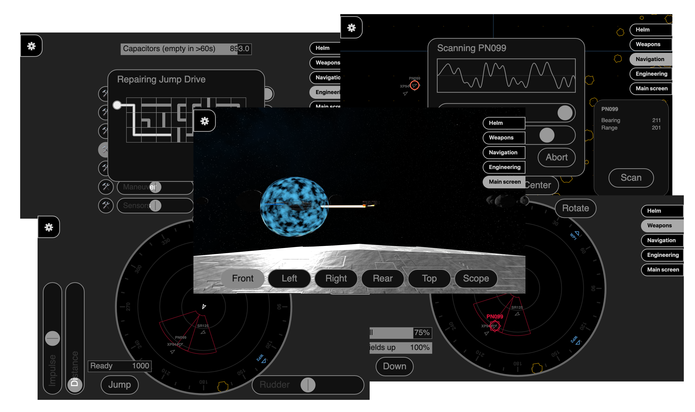

 

## Star Cruiser Crew Simulator

A cooperative game in which players man the stations of a sci-fi spaceship. Each player can only
control a small part of the ship and relies heavily on information given by the other players.

*All ship stations (from release 0.26.0)*

This project is heavily inspired by games such as 
[Artemis Spaceship Bridge Simulator](https://artemisspaceshipbridge.com/) (commercial software), 
[Empty Epsilon](https://daid.github.io/EmptyEpsilon/) (open source, source at https://github.com/daid/EmptyEpsilon)
and [Space Nerds In Space](https://smcameron.github.io/space-nerds-in-space/) 
(open source, source at https://github.com/smcameron/space-nerds-in-space/).

However, this project has some special goals:
* Clients run inside a browser, therefore should support most platforms, especially mobile devices.
* Server runs an any platform that can run a JVM.

There are also some technical goals:
* All code is written in [Kotlin](https://kotlinlang.org/) (client/server/shared).
* Server runs on [Ktor](https://ktor.io/servers/index.html) using coroutines.
* Client/server communication uses [WebSocket](https://javascript.info/websocket) with JSON payloads.
* Client code is independent of the server.
* No game logic runs on the clients, they only send commands and receive state updates.

### Preconditions

* Java 8+, tested with 8, 11, 13, 14 and 15 (e.g. [OpenJDK Azul](https://www.azul.com/downloads/zulu-community/?version=java-15-mts&package=jdk))

### How to run

    ./gradlew :server:run
    
Then open the following URL in a browser

    http://localhost:35667

Spawn a ship and click it, now you should see a radar-like UI.
Try clicking or dragging stuff, also works for touch devices.
Change ship stations via the buttons on the right.

### Thanks to

Initial space ship model created by [niko-3d-models](https://niko-3d-models.itch.io). 
The model is from the [free sci-fi spaceships pack](https://niko-3d-models.itch.io/free-sc-fi-spaceships-pack).

Textures for sky box created with [Spacescape](http://wwwtyro.github.io/space-3d) 
(Source: https://github.com/petrocket/spacescape).
